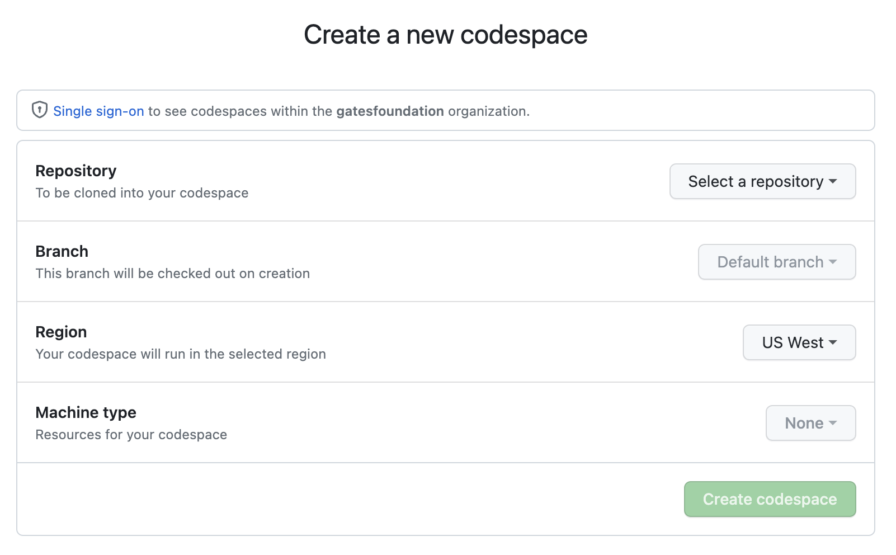
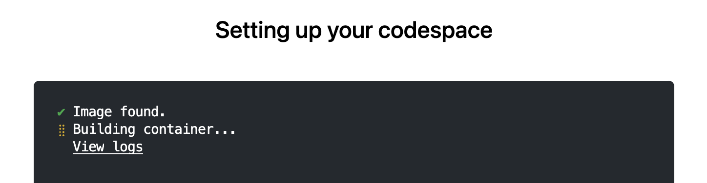
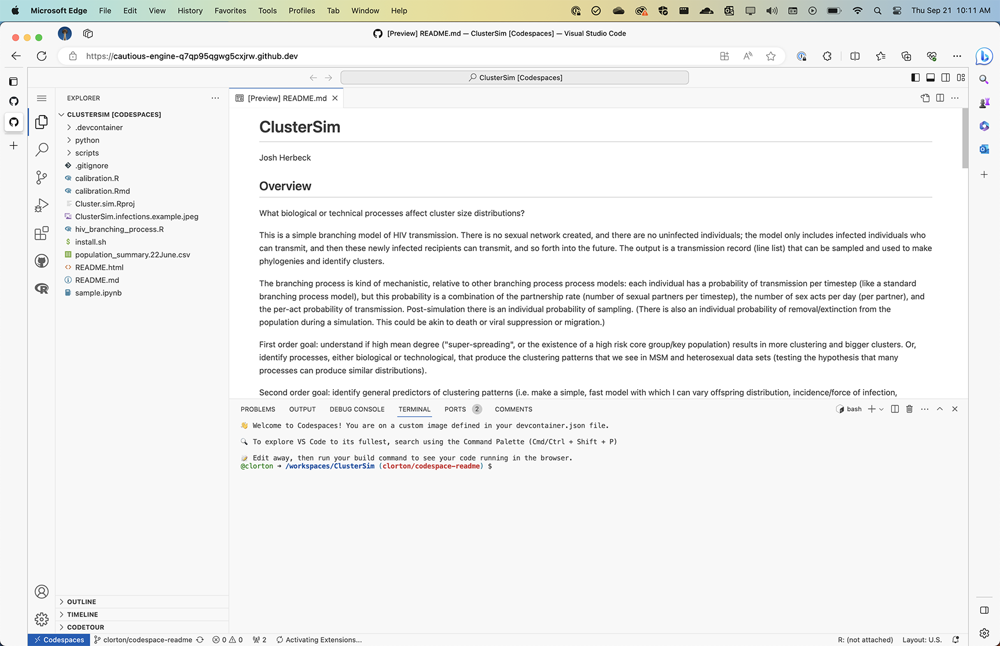
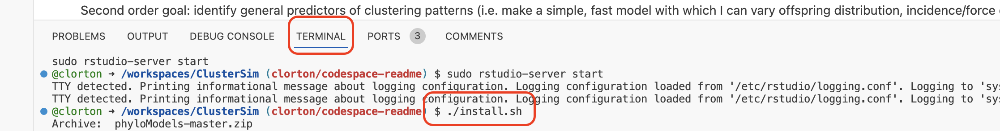
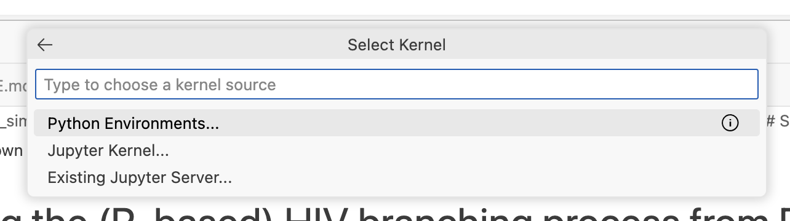
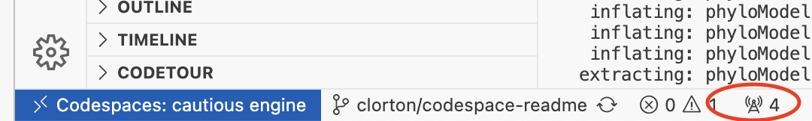
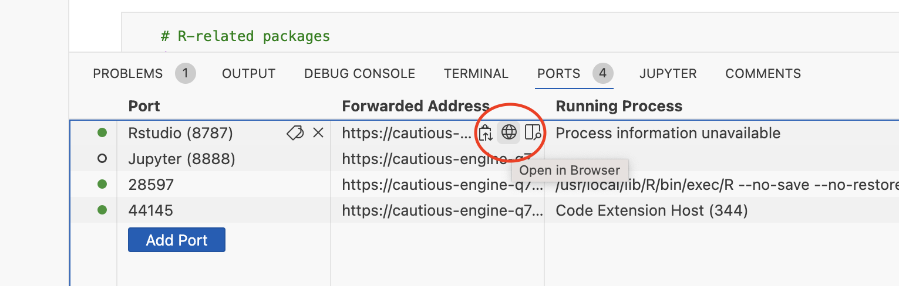
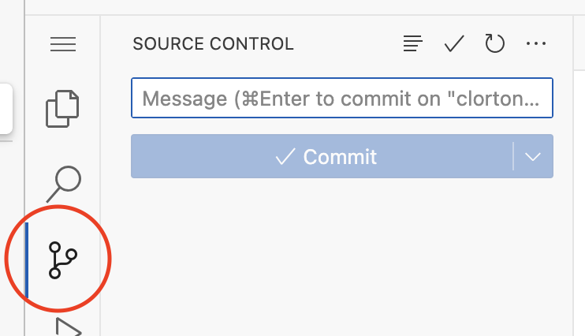

# Working with this code in a GitHub Codespace

**_Even if you don't need any of this information about getting started with GitHub Codespaces, please read the [note at the bottom](./CODESPACE.md#phylomodels-python-package) about installing the Phylomodels Python package in the codespace._**

## Getting Started

You can work with this code in a container/VM hosted by GitHub through [GitHub Codespaces](https://github.com/features/codespaces).

You will need access to the repository (request permissions from the owner) or a fork of the repository.

From [https://github.com/codespaces] use the green "New codespace" button in the upper right:


1. Find this repository in the "Select a repository" list.
2. Select the branch you plan to work in (this can be changed later).
3. _Do not change the `Dev container configuration` - you want that comes with the repository._
4. You can leave the `Region` as its default.
5. For starters you can leave the `Machine type` as its default also (this can be changed later if you need more memory or CPU).
6. Select "Create codespace"



It may take as much as 5 minutes to first start up the codespace (GitHub is using the information in the `.devcontainer` folder to create the working environment). The codespace can be stopped when you are not using it (on its own, it will spin down after 30 minutes of inactivity) and re-started without the 5 minute wait. Note that your codespace will have a non-sensical but human readable name like _"opulent adventure"_ or _"automatic space chainsaw"_. As long as you are using this same codespace, you will not have the long startup time. If you delete the codespace and recreate it later (i.e., it has a new name), you will experience the longer startup time again.



Once the environment has been built and started, you will get a version of [VS Code](https://code.visualstudio.com/) in your browser. Note that nearly all the features of a locally installed version of VS Code will be available to you (many helpful Microsoft and 3rd party extensions, Git source code control integrated, etc.)



## Phylomodels Python Package

The Phylomodels Python packages isn't public yet which prevents us from automagically installing it in the working environment. We have a zipped copy of the source code (circa mid-September 2023) which needs to be manually installed once after starting up the codespace.

Do this by selecting the "TERMINAL" pane at the bottom of the window and running `install.sh` with

```shell
./install.sh
```



This should take 15-20 seconds and finish with something like this:

```shell
Installing collected packages: tbb, PyQt5-Qt5, ply, ipython-genutils, intel-openmp, xlrd, sip, qtpy, PyQt5-sip, networkx, mkl, lxml, et-xmlfile, unittest-xml-reporting, PyQt5, openpyxl, qtconsole, jupyter-console, notebook, jupyter, phyloModels
  Running setup.py develop for phyloModels
Successfully installed PyQt5-5.15.9 PyQt5-Qt5-5.15.2 PyQt5-sip-12.12.2 et-xmlfile-1.1.0 intel-openmp-2023.2.0 ipython-genutils-0.2.0 jupyter-1.0.0 jupyter-console-6.6.3 lxml-4.9.3 mkl-2023.2.0 networkx-3.1 notebook-7.0.4 openpyxl-3.1.2 phyloModels ply-3.11 qtconsole-5.4.4 qtpy-2.4.0 sip-6.7.11 tbb-2021.10.0 unittest-xml-reporting-3.2.0 xlrd-2.0.1
```

## Working with Jupyter Notebooks

Each time you start the codespace and open a Jupyter notebook (`.ipynb` files, generally in the `python` folder), you may be asked to connect to a kernel. "Python Environments..." and the "Recommended" `/bin/python3` is ... recommended.



## Working with RStudio Server

Unlike Jupyter notebooks which are hosted in the Codespace VS Code instance, access to RStudio server is through a separate browser window connected to the server running in the codespace.

1. Select the small "radio tower" icon in the bottom status bar.



2. Hover over the line with "Rstudio" in the "Port" column to reveal and select the globe icon in the "Forwarded Address" column. This will open a new browser tab connected to the RStudio server running in the codespace. Changes made and saved in this interface are persisted in the codespace. I.e., you can see and commit changes made in the RStudio server tab in the source code pane of the VS Code tab.




